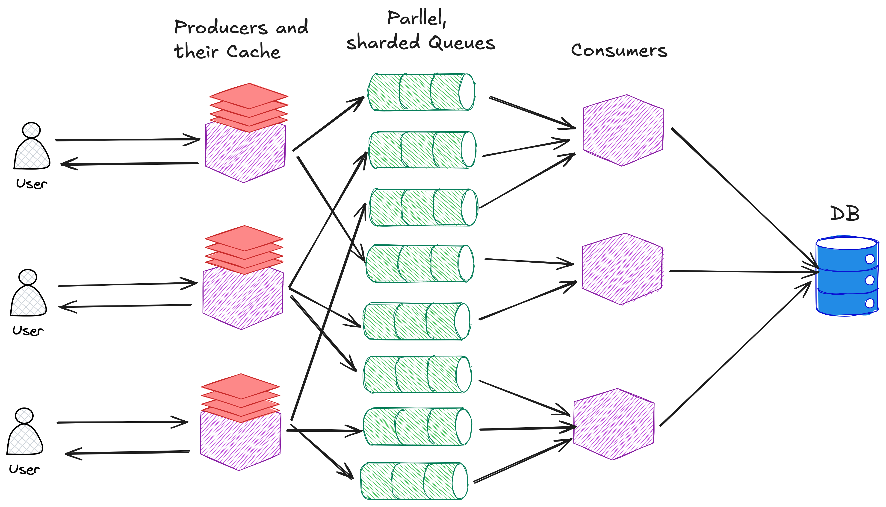

## Architecture

This service is standalone - it does not reach out to any other service. I decided to use Cloudflare KV instead of Upstash Redis as after testing, KV outperformed Redis significantly.

Let's begin with a simplified example. We have a user who makes a request to a Doubly short link such as `https://doubly.dev/abc123`. This request is caught by a serverless function (Cloudflare Worker) that lives on the edge (very close to the users physical location). This function parses the request, and extracts the short link (ie. `abc123`). The function then checks a fast, in-memory database (Cloudflare KV) to see what URL the short link corresponds to. For example, maybe `abc123` maps to `https://www.google.com`. Once the function has the URL, it collects some metadata about the requester (location, device, time, etc.) and pushes that information into a queue (Cloudflare Queue). Without waiting for the metadata to be processed, the function returns and redirects the user to the URL (`https://www.google.com`). This minimal work on the happy-path is what allows for the blazing fast response time. I call this function the *Producer*, because it produces events to be consumed by the queue.

After either a fixed amount of time has passed (something like 5s) or after the queue has a total of 100 events enqueued, the queue  will push a batch of events (up to a maximum of 100) from the front of the queue over to another servless function, which I call the *Consumer*. The Consumers job is to take in a batch of click events, validate them, and insert them into our database. This is probably a good time to answer the question "why are we using a queue?". Good question. I actually started off by having no queues or consumers. The Producer was responsible for everything mentioned abve as well as writing to the database. While this works for a low number of RPS, it begins being very slow when our RPS grows. This is because every single event will trigger a separate write event to the database. The database technology we use here is a Neon Postgres database using TimescaleDB Hypertables (more on that later) which perform best when write events are batched. When the events are not batched, the time to write increased significantly, which in some slowed down the entire system. Additionally, the queues help smooth out a  sudden sharp burst of traffic. Imagine the system is experiencing a constant flow of 100 RPS and then suddenly gets 100k RPS for 1s. Writing directly to the database would create 100k pooled connections which the DB cannot handle, whereas with queues we would create 1k pooled connections which it can handle. And finally, queues have an infinity capacity, so we can have them simply wait until the RPS drops down to finish emitting the events to Consumers.


What I have explained so far is a simplified version of the architecture. In reality, we have many users, producers, key-value stores, queues, and consumers. Additionally, we actually have manually sharded queues. Cloudflare Queues have limits on the number of events that can be added to a queue, so to get around this limitation we actually create many queue copies and send click events to the different queues at random.

Another aspect not mentioned is the extra use of caching at the producer layer. Heres how it works. A request comes into a producer, and we extrac the short link (ie. `abc123`). We then check the producers local cache to see if this exact producer has made performed this lookup recently. If not, then we check the nearby Cloudflare KV store which should have a mapping of all short links to urls. You can think of this step like a Redis caching layer. Finally, if the KV does not see the short link, we fallback to looking inside the database.

Here is a more complete diagram (though I am still not drawing the possible connection from the producer to the DB as that is an unfrequent operation).



### Upstash Redis VS Cloudflare KV

Before doing any load testing, I wanted to check to see whether Upstash Redis or Cloudflare KV would be a better option for caching short links. As both services are offered globally, and can allow for a virtually unlimited number of reads/writes, my main focus was which service was faster. I did several quick tests from multiple regions and found that Upstash was consitently faster for cold-key lookups, but slower for warm-key lookups. This was true across all regions.

Cold reads, time in ms.

```
{"redisLatency":63,"kvLatency":174}
{"redisLatency":81,"kvLatency":178}
```

Warm reads, time in ms.

```
{"redisLatency":61,"kvLatency":4}
{"redisLatency":54,"kvLatency":5}
{"redisLatency":33,"kvLatency":3}
{"redisLatency":57,"kvLatency":4}
```

Seeing as though a link redirect service is likely to be handling a lot of traffic, it seems that KV is the better option.
