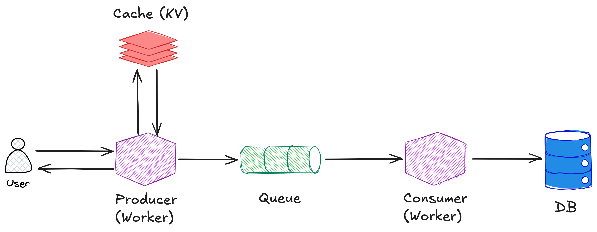
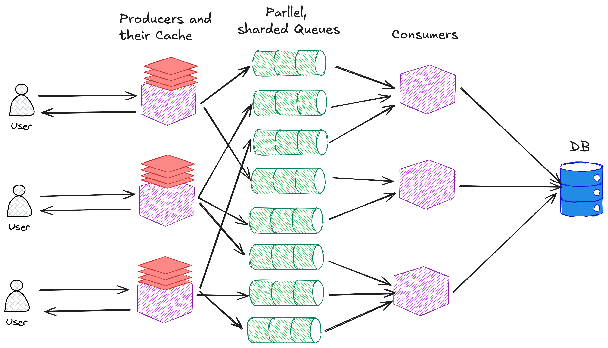
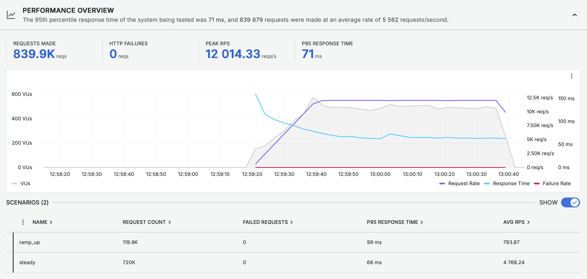
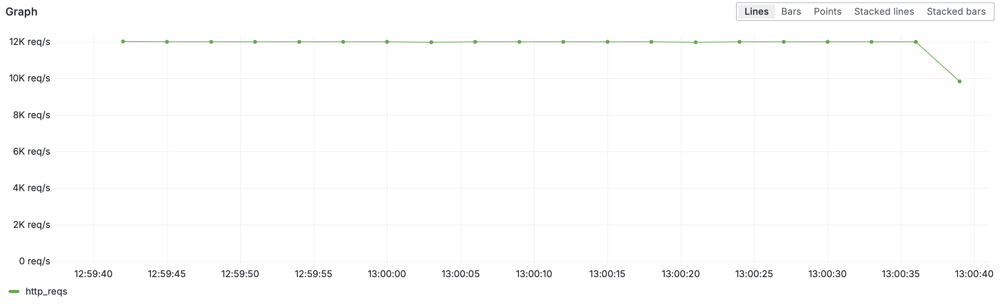
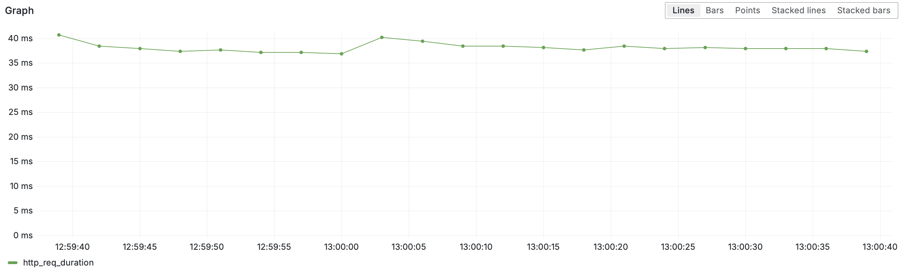
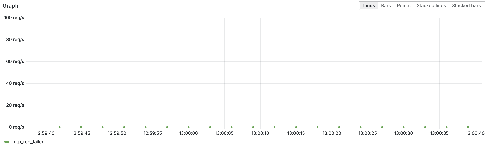
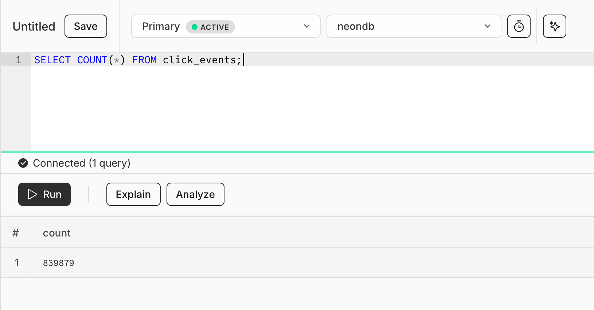
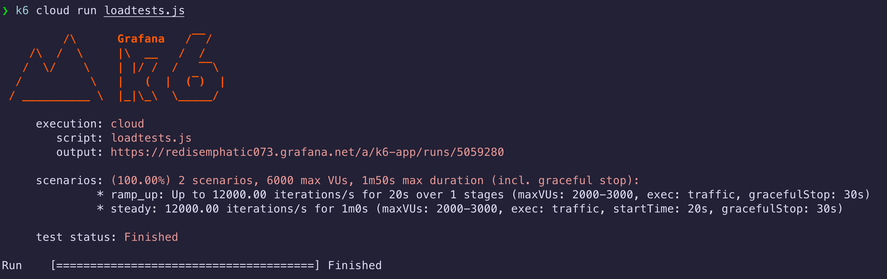

- [Introduction](#introduction)
- [How Does it Work? - Architecture](#how-does-it-work---architecture)
- [How to use](#how-to-use)
- [Images from Grafana](#images-from-grafana)
- [Images from Neon](#images-from-neon)
- [Images from Running Tests](#images-from-running-tests)
- [Test History](#test-history)
- [Upstash Redis VS Cloudflare KV](#upstash-redis-vs-cloudflare-kv)

## Introduction

This repo contains everything needed to run the high-performance [Doubly](https://doubly.dev) backend. 


### How Does it Work? - Architecture

This service is standalone - it does not reach out to any other service. I decided to use Cloudflare KV instead of Upstash Redis as after testing, KV outperformed Redis significantly. 

Let's begin with a simplified example. We have a user who makes a request to a Doubly short link such as `https://doubly.dev/abc123`. This request is caught by a serverless function (Cloudflare Worker) that lives on the edge (very close to the users physical location). This function parses the request, and extracts the short link (ie. `abc123`). The function then checks a fast, in-memory database (Cloudflare KV) to see what URL the short link corresponds to. For example, maybe `abc123` maps to `https://www.google.com`. Once the function has the URL, it collects some metadata about the requester (location, device, time, etc.) and pushes that information into a queue (Cloudflare Queue). Without waiting for the metadata to be processed, the function returns and redirects the user to the URL (`https://www.google.com`). This minimal work on the happy-path is what allows for the blazing fast response time. I call this function the *Producer*, because it produces events to be consumed by the queue.

After either a fixed amount of time has passed (something like 5s) or after the queue has a total of 100 events enqueued, the queue  will push a batch of events (up to a maximum of 100) from the front of the queue over to another servless function, which I call the *Consumer*. The Consumers job is to take in a batch of click events, validate them, and insert them into our database. This is probably a good time to answer the question "why are we using a queue?". Good question. I actually started off by having no queues or consumers. The Producer was responsible for everything mentioned abve as well as writing to the database. While this works for a low number of RPS, it begins being very slow when our RPS grows. This is because every single event will trigger a separate write event to the database. The database technology we use here is a Neon Postgres database using TimescaleDB Hypertables (more on that later) which perform best when write events are batched. When the events are not batched, the time to write increased significantly, which in some slowed down the entire system. Additionally, the queues help smooth out a  sudden sharp burst of traffic. Imagine the system is experiencing a constant flow of 100 RPS and then suddenly gets 100k RPS for 1s. Writing directly to the database would create 100k pooled connections which the DB cannot handle, whereas with queues we would create 1k pooled connections which it can handle. And finally, queues have an infinity capacity, so we can have them simply wait until the RPS drops down to finish emitting the events to Consumers. 



What I have explained so far is a simplified version of the architecture. In reality, we have many users, producers, key-value stores, queues, and consumers. Additionally, we actually have manually sharded queues. Cloudflare Queues have limits on the number of events that can be added to a queue, so to get around this limitation we actually create many queue copies and send click events to the different queues at random. 

Another aspect not mentioned is the extra use of caching at the producer layer. Heres how it works. A request comes into a producer, and we extrac the short link (ie. `abc123`). We then check the producers local cache to see if this exact producer has made performed this lookup recently. If not, then we check the nearby Cloudflare KV store which should have a mapping of all short links to urls. You can think of this step like a Redis caching layer. Finally, if the KV does not see the short link, we fallback to looking inside the database. 

Here is a more complete diagram (though I am still not drawing the possible connection from the producer to the DB as that is an unfrequent operation).




### How to use

To run this service you will need a [Neon DB](https://neon.com/) account (free), and a [Cloudflare Workers](https://workers.cloudflare.com/) account (paid). You will need to provide the Neon DB database URL to both the producer and consumer workers. You will also need to create a Worker KV to be used for quickly looking up short links. You will need to create some queues. The number of queues you create depend on the expected traffic you will face. I would recommend trying to keep the average RPS per queue to around 500. So if you expect 1000 RPS, create 2 queues. If you expect 12,000 RPS create 24 queues. 

> Manually creating queues to match the expected RPS is only necessary because of Cloudflare acount limits. You can have Cloudflare lift the limits by paying more, in which case a single queue is fine. 

Once your KV and Queues are created, update the both the `wrangler.jsonrc` and `index.ts` files for both the consumer and the producer workers with the appropriate KV and Queue bindings. 

When your producer is now reached, at something like `https://your-url/abcdef123456` the producer will check the worker cache, then the KV and see no match, and will then reach out to the database to get the short link. Once it retrieves the link, it will populate the KV and will redirect you to the destination url. 

### How to test

To test the performance of this service you will need a [Grafana Labs](https://grafana.com/) account (paid). You will also need to download the [K6 CLI tool](https://grafana.com/docs/k6/latest/set-up/install-k6/). Then you can simply configure the RPS, virtual users (VUs), and test time in `load-test.js`. Once you are ready to run your tests, simply run:

```
k6 cloud run load-tests.js
```

### Images from Grafana



Requests per Second (RPS). This tests was held at a constant 12,000 RPS for 60 seconds. The little dip at the end was the test finishing. 



Median Request Duration. Held at a very constant 35-40ms.



P90 Response Time. This graph tells us how quickly the fastest 90% of requests at each time interval were. We can see that this was a little under 60ms for the majority of the test, meaning that 90% of the requests completed in under 60ms.


P99 Response Time. This graph tells us how quickly the fastest 99% of requests at each time intereval were. We can see that this was a little under 90ms for the majority of the test, meaning that 99% of the requests completed in under 90ms.


Request Failure Rate. Shows the number of requests which failed to redirect to the destination url (ie. `https://doubly.dev/abc123` → `https://www.google.com`)



### Images from Neon

A query performed immediately after the test to view the number of entries in the `click_events` table. 839,879 events are present which is the same number of requests made by Grafana.



### Images from Running Tests

This screenshot shows what it looks like to run the tests.



### Test History

I didn't just land on the final architecture and test configuration. It took many tests and a lot of trial and error. Here are a few notable tests that were made along the way, along with my notes on how the test went. 

##### Test #1
Duration: 10s
Request/s: 10
Total Requests: 100
Daily Rate: 864K requests/day

> Completed successfully. Redirect time dropped to around 25ms after being fully warmed. 100/100 events successfully inserted into the database.

##### Test #2
Duration: 30s
Request/s: 100
Total Requests: 3000
Daily Rate: 8.64M requests/day

> Completed successfully. P95 response time was 58ms, but I noticed that after the system had been running for 10-15s the response time seemed to drop to around 42ms, so there still might have been some cold-start influence. 3001/3001 events successfully inserted into the database.

##### Test #3

Duration: 60s
Request/s: 500
Total Requests: 30,000
Daily Rate: 43.2M requests/day

> Completed successfully. P95 response time was 61ms. Interestingly, the response time stayed around 35ms for most of the test, but jumped to 70ms at the end (last 10 seconds). I am unsure why this is. 30,001/30,001 events successfully inserted into the database.

##### Test #4

Duration: 30s
Request/s: 1000
Total Requests: 30,000
Daily Rate: 86.4M requests/day

> Completed successfully. P95 response time of 71ms. This is higher, but I suspect its because of my new logic and round robin queueing. 29,996/30,001 events were inserted into the database. Of those 5 events, 2 redirected properly but their event data failed to enter the queue, and for the other 3 they failed both redirection and db insertion.

##### Test #5

Duration: 20s
Request/s: 3000
Total Requests: 60,000
Daily Rate: 259.2M requests/day

> Completed successfully. P95 response time of 71ms, but this was a short test and it was trending down to ~60ms at the end. 60,002/60,002 events were inserted into the database. 

##### Test #6

Duration: 60s
Request/s: 3000
Total Requests: 180,000
Daily Rate: 259.2M requests/day
Monthly Rate: 7.7B requests/month

> Completed successfully. P95 response time of 57ms. 180,000/180,001 events were inserted into the database. I think this response time more accurately reflects reality since we have 20k links and we need a while to warm them up.

##### Test #7

Duration: 20s
Request/s: 12,000
Total Requests: 240,000
Daily Rate: 1.03B requests/day
Monthly Rate: 31B requests/month

> Failed. 165k / 244k requests failed with status 403. Further investigation discovered that requests were being blocked by Coudflares DDoS firewall. Need to figure out how to get around that.


##### Test #8

Duration: 20s
Request/s: 12,000
Total Requests: 240,000
Daily Rate: 1.03B requests/day
Monthly Rate: 31B requests/month

> Failed, but better. Only 4/241763 requests failed, but somehow 270k events were inserted into the database. I suspect this is due to the queues "at least once" behaviour. Solution is to add a unique id to each event. Also interesting to note that the request time got down to 45ms at the end of the test - showing the caching taking effect. Also interesting is the spike in response time when the test started. My thinking is that this was from many cold keys being hit. Perhaps these should be hit during setup as well as the hot links to prevent the spike. Also had a single request take 2s which is interesting. Perhaps many retries.

##### Test #9

Duration: 20s
Request/s: 6,000
Total Requests: 123,319
Daily Rate: 518M requests/day
Monthly Rate: 15.5B requests/month

> Success! P95 response time of 132ms. 123,319/123,319 events were inserted into the database. Very happy with the request success rate, but the response time is much worse. Not sure what happened there - warrants investigation.

##### Test #10

Duration: 20s
Request/s: 12,000
Total Requests: 241,600
Daily Rate: 1.03B requests/day
Monthly Rate: 31B requests/month

> Success! P95 response time of 90ms. A median response time of under 40ms once the test was underway! 241,596/241,600 events were inserted into the database - 99.998%. 

##### Test #11

Duration: 60s (with 20s ramp-up)
Request/s: 12,000
Total Requests: 839,879
Daily Rate: 1.03B requests/day
Monthly Rate: 31B requests/month

> Success! P95 response time of 66ms. A median response time of under 40ms once the test was underway! 839,879/839,879 events were inserted into the database (100%)! 

### Upstash Redis VS Cloudflare KV

Before doing any load testing, I wanted to check to see whether Upstash Redis or Cloudflare KV would be a better option for caching short links. As both services are offered globally, and can allow for a virtually unlimited number of reads/writes, my main focus was which service was faster. I did several quick tests from multiple regions and found that Upstash was consitently faster for cold-key lookups, but slower for warm-key lookups. This was true across all regions. 

Cold reads, time in ms.
```
{"redisLatency":63,"kvLatency":174}
{"redisLatency":81,"kvLatency":178}
```

Warm reads, time in ms.
```
{"redisLatency":61,"kvLatency":4}
{"redisLatency":54,"kvLatency":5}
{"redisLatency":33,"kvLatency":3}
{"redisLatency":57,"kvLatency":4}
```

Seeing as though a link redirect service is likely to be handling a lot of traffic, it seems that KV is the better option.


```
 npx wrangler kv bulk put kv.json --namespace-id=7fdaccaf9072443db29e72b452dd8254 --remote
```
