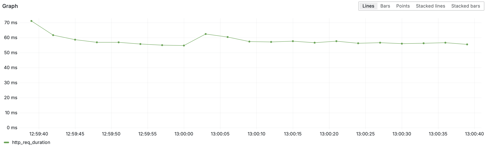

- [Overview](#overview)
- [Architecture](#architecture)
- [Usage](#usage)
- [Tests](#tests)
- [Results](#results)

## Overview

This repository contains everything needed for the high-performance backend of [doubly.dev](https://doubly.dev/). It’s designed to handle over **1 billion requests per day** with a **median response time under 40 ms**, making it ideal for large-scale link-shortening use cases.

If you're looking for the Doubly frontend, check it out here: [github.com/mhwice/doubly](https://github.com/mhwice/doubly).

## Architecture

This backend is designed for **edge-first, highly scalable link redirecting**, handling 1B+ daily requests with low latency.

### Components Overview
- **Producer** – Cloudflare Worker on the edge  
- **Consumer** – Serverless batching function  
- **Queue Shards** – Multiple Cloudflare Queues for throttling  
- **Cache tiers** – Local → KV → DB  
- **Postgres + TimescaleDB** – High-throughput event storage

### Data/Request Flow  


### Key Design Decisions
| Area              | Choice              | Why?                                     |
| ----------------- | ------------------- | ---------------------------------------- |
| KV vs Redis       | Cloudflare KV       | Lower warm-key latency at scale          |
| Batching & Queues | Queues + Consumer   | Prevent DB overload; smooth bursts       |
| Caching Strategy  | In-memory + KV + DB | Minimize edge latency; fallback handling |

[Full architecture docs → [ARCHITECTURE.md](https://github.com/mhwice/doubly-redirect-service/ARCHITECTURE.md)]

## Usage

To run this service you will need a [Neon DB](https://neon.com/) account (free), and a [Cloudflare Workers](https://workers.cloudflare.com/) account (paid). You will need to provide the Neon DB database URL to both the producer and consumer workers. You will also need to create a Worker KV to be used for quickly looking up short links. You will need to create some queues. The number of queues you create depend on the expected traffic you will face. I would recommend trying to keep the average RPS per queue to around 500. So if you expect 1000 RPS, create 2 queues. If you expect 12,000 RPS create 24 queues. 

> Manually creating queues to match the expected RPS is only necessary because of Cloudflare acount limits. You can have Cloudflare lift the limits by paying more, in which case a single queue is fine. 

Once your KV and Queues are created, update the both the `wrangler.jsonrc` and `index.ts` files for both the consumer and the producer workers with the appropriate KV and Queue bindings. 

When your producer is now reached, at something like `https://your-url/abcdef123456` the producer will check the worker cache, then the KV and see no match, and will then reach out to the database to get the short link. Once it retrieves the link, it will populate the KV and will redirect you to the destination url. 

## Tests

### Configuration

Tested using Grafana K6. 

To prepare the tests, 20,000 short links were created in the database, each mapping to `https://www.google.com`. A key-value pair mapping their short link to Google url were saved inside a Cloudfalre KV. This is what would normally happen when a user creates a new link via the frontend. 

The test then consisted of two stages: the ramp-up, and the constant rate test. The ramp-up stage conisted of a slow increase in the RPS from 0 to the desired RPS over a 20 second period. This was done to slowly warm up the each component (KV store, workers, etc.). This also prevented nasty CPU spikes which could arrive if we go from 0-12k RPS, which isn't realistic. After the ramp-up stage is complete, we hold the RPS at the desired rate (12k RPS) for the desired period (60s).

Before running the tests, the 20,000 short links were partitioned into two sets of links called *hot links* and *cold links* with an 20/80 split. Then, during the both stages of the test, for each request, we pick from the *hot links* 80% of the time, and from the *cold links* 20% of the time. This was done to more closely mirror reality. If our service has 20k links, it is more likely that a smaller number of links will drive a high amount of the total traffic, and that the majority of the links will drive little traffic. In code this looks like this:

```js
const n = shortlinks.length;
const twenty = Math.floor(0.2 * n);
const hotLinks = shortlinks.slice(0, twenty); // first 20% of links are hot
const coldLinks = shortlinks.slice(twenty); // last 80% of links are cold

let code;
if (Math.random() < 0.80) {
  code = hotLinks[Math.floor(Math.random() * hotLinks.length)];
} else {
  code = coldLinks[Math.floor(Math.random() * coldLinks.length)];
}
```

And then we make the request to `https://doubly.dev/{code}`.

To test the performance of this service you will need a [Grafana Labs](https://grafana.com/) account (paid). You will also need to download the [K6 CLI tool](https://grafana.com/docs/k6/latest/set-up/install-k6/). Then you can simply configure the RPS, virtual users (VUs), and test time in `load-test.js`. Once you are ready to run your tests, simply run:

```
k6 cloud run load-tests.js
```

This screenshot shows what it looks like to run the tests.


### Test History


**Test #11 (Final):**

| RPS    | Duration | P95 Latency | Success Rate |
| ------ | -------- | ----------- | ------------ |
| 12 000 | 60 s     | 66 ms       | 100%         |

<details>
  <summary>View full test history</summary>

  | Test | Duration         | RPS    | Total Requests | P95 Latency | Inserts           | Notes                                       |
  | ---- | ---------------- | ------ | -------------- | ----------- | ----------------- | ------------------------------------------- |
  | #1   | 10 s             | 10     | 100            | ~25 ms      | 100 / 100         | Fully warmed                                |
  | #2   | 30 s             | 100    | 3 000          | 58 ms       | 3 001 / 3 001     | Some cold‑start effect                      |
  | #3   | 60 s             | 500    | 30 000         | 61 ms       | 30 001 / 30 001   | Spike to 70 ms at end                       |
  | #4   | 30 s             | 1 000  | 30 000         | 71 ms       | 29 996 / 30 001   | 5 queue/redirect errors                     |
  | #5   | 20 s             | 3 000  | 60 000         | 71 ms       | 60 002 / 60 002   | Trending down toward ~60 ms                 |
  | #6   | 60 s             | 3 000  | 180 000        | 57 ms       | 180 000 / 180 001 | Accurately warmed                           |
  | #7   | 20 s             | 12 000 | 240 000        | —           | —                 | 165 000 failures (Cloudflare DDoS firewall) |
  | #8   | 20 s             | 12 000 | 241 763        | —           | ~270 000          | Duplicates due to at‑least‑once behavior    |
  | #9   | 20 s             | 6 000  | 123 319        | 132 ms      | 123 319 / 123 319 | —                                           |
  | #10  | 20 s             | 12 000 | 241 600        | 90 ms       | 241 596 / 241 600 | Median < 40 ms                              |
  | #11  | 60 s (20 s ramp) | 12 000 | 839 879        | 66 ms       | 839 879 / 839 879 | Median < 40 ms                              |

</details>


## Results


Requests per Second (RPS). This tests was held at a constant 12,000 RPS for 60 seconds. The little dip at the end was the test finishing. 


Median Request Duration. Held at a very constant 35-40ms.


P90 Response Time. This graph tells us how quickly the fastest 90% of requests at each time interval were. We can see that this was a little under 60ms for the majority of the test, meaning that 90% of the requests completed in under 60ms.



P99 Response Time. This graph tells us how quickly the fastest 99% of requests at each time intereval were. We can see that this was a little under 90ms for the majority of the test, meaning that 99% of the requests completed in under 90ms.


Request Failure Rate. Shows the number of requests which failed to redirect to the destination url (ie. `https://doubly.dev/abc123` → `https://www.google.com`)


A query performed immediately after the test to view the number of entries in the `click_events` table. 839,879 events are present which is the same number of requests made by Grafana.


