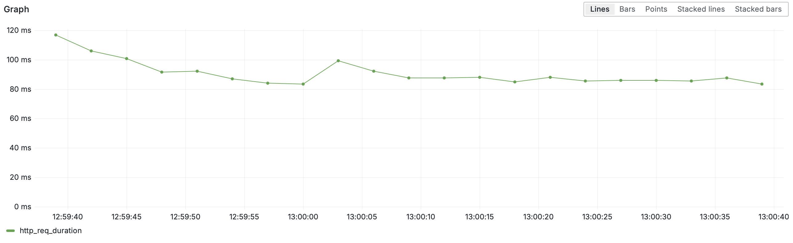

Doubly is a powerful link shortener and analytics platform that not only generates compact proxy URLs but also captures rich click data—everything from device type and geographic location to timestamp and referrer. With Doubly you simply provide a destination URL, get back a smart short link, and then watch as every click is logged and visualized in a clean, user‑friendly dashboard. Drill down by browser, OS, country (or any combination thereof) over any timeframe and turn raw clicks into actionable insights—no manual instrumentation required.

- [Overview](#overview)
- [Tech Stack](#tech-stack)
- [Architecture](#architecture)
- [Benchmarking](#benchmarking)
- [Performance](#performance)

## Overview

This repository contains everything needed for the high-performance link-redirect backend of [doubly.dev](https://doubly.dev/). It’s designed to handle over **1 billion requests per day** with a **median response time under 40 ms**, making it ideal for large-scale link-shortening use cases.

If you're looking for the Doubly frontend, check it out here: [github.com/mhwice/doubly](https://github.com/mhwice/doubly).

## Tech Stack

- [Neon](https://neon.tech/) - Serverless Postgres database
- [TimescaleDB Hypertable](https://docs.timescale.com/use-timescale/latest/hypertables/) - Fast time-series Postgres tables
- [Cloudflare Workers](https://workers.cloudflare.com/) - Serverless, edge functions
- [Cloudflare KV](https://developers.cloudflare.com/kv/) - Serverless, edge key/value storage
- [Cloudflare Queues](https://developers.cloudflare.com/queues/) - Serverless queues
- [Grafana k6](https://grafana.com/products/cloud/k6/?src=k6io) - Automated load testing

## Architecture

This backend is designed for **edge-first, highly scalable link redirecting**, handling 1B+ daily requests with low latency and high reliability.

### Components Overview
- **Producer** – Cloudflare Worker on the edge  
- **Consumer** – Serverless batching function  
- **Queue Shards** – Multiple Cloudflare Queues for throttling  
- **Cache tiers** – Local → KV → DB  
- **Postgres + TimescaleDB** – High-throughput event storage

### Data/Request Flow  


### Key Design Decisions
| Area                   | Choice              | Why?                                              |
| ---------------------- | ------------------- | ------------------------------------------------- |
| Cloudflare KV vs Redis | Cloudflare KV       | Lower warm-key latency; faster; unified platforms |
| Batching & Queues      | Queues + Consumer   | Prevent DB overload; smooth bursts                |
| Caching Strategy       | In-memory + KV + DB | Minimize edge latency; fallback handling          |

[Full architecture docs → [ARCHITECTURE.md](ARCHITECTURE.md)]

## Benchmarking

We use **Grafana k6** to benchmark the service under realistic traffic patterns, simulating both a warm-up phase and a steady-state load. To run the tests yourself, you'll need to install the [k6 CLI](https://grafana.com/docs/k6/latest/set-up/install-k6/) and have a [Grafana Cloud account](https://grafana.com/) (paid).

### Configuration

To simulate a production-like environment, we preloaded the database with 20,000 short links, all pointing to `https://www.google.com`. Each short link was also stored in the Cloudflare KV store, mimicking the behavior of the frontend when a user creates a new link.

The test is structured in two phases:

1. **Ramp-up phase** – Gradually increases the request rate from 0 to the target requests-per-second (RPS) over 20 seconds. This avoids sudden CPU or resource spikes and allows components like the KV store and workers to warm up.
2. **Steady-state phase** – Maintains the target rate (e.g., 12,000 RPS) for a defined duration (e.g., 60 seconds).

To simulate realistic traffic patterns, the 20,000 short links were split into two groups:

- **Hot links** (20% of 20,000) – Frequently accessed
- **Cold links** (80% of 20,000) – Infrequently accessed

Each request randomly selects from the hot links 80% of the time and from the cold links 20% of the time. This skews the traffic distribution to more closely reflect real-world usage, where a small number of popular links receive the majority of traffic.

The link selection logic in the test script looks like this:

```js
const n = shortlinks.length;
const twenty = Math.floor(0.2 * n);
const hotLinks = shortlinks.slice(0, twenty); // first 20% of links are hot
const coldLinks = shortlinks.slice(twenty); // last 80% of links are cold

let code;
if (Math.random() < 0.80) {
  code = hotLinks[Math.floor(Math.random() * hotLinks.length)];
} else {
  code = coldLinks[Math.floor(Math.random() * coldLinks.length)];
}
```

Each request is sent to the service like so:

```
https://doubly.dev/{code}
```

### Running the Test

To run the test:

1. Install the k6 CLI.
2. Set your desired RPS, virtual users (VUs), and test duration in `load-tests.js`.
3. Execute the test using:

```
k6 cloud run load-tests.js
```

Your script will be uploaded and executed in the Grafana Cloud environment. The output will look like this:


## Performance

We sustained **12 000 RPS** for **60 s** with a **100% response success rate** and **median latency < 40 ms**.

| Metric         | Value                   |
| -------------- | ----------------------- |
| Sustained RPS  | 12 000                  |
| Duration       | 60 s (with 20s ramp up) |
| Success Rate   | 100%                    |
| Median Latency | < 40 ms                 |
| P90 Latency    | < 60 ms                 |
| P99 Latency    | < 90 ms                 |

### Requests per Second
Held constant at 12 000 RPS for 60 s. The dip at the end marks test completion.


### Latency Percentiles

- Median (50th): ~ 35–40 ms
- P90                :       < 60 ms
- P99                :       < 90 ms




### Failure Rate
Zero failed redirects.


### Data Integrity
839,879 entries in `click_events`— exactly the number of test requests.

